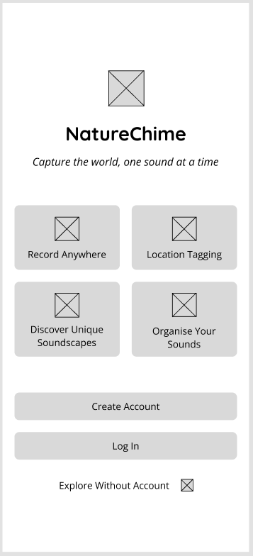
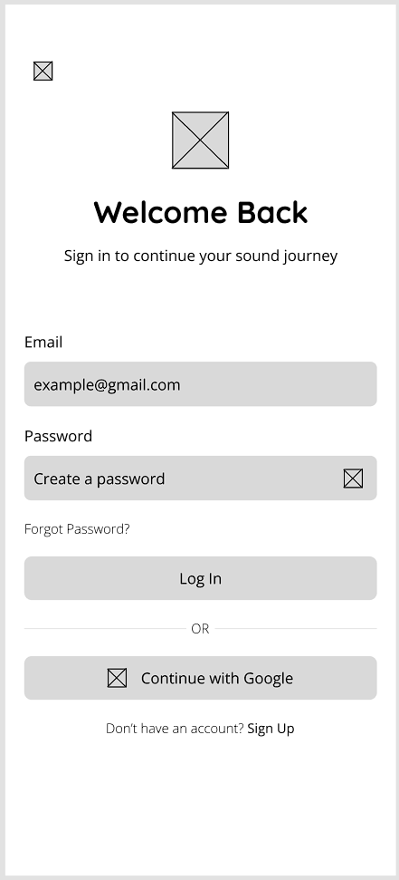
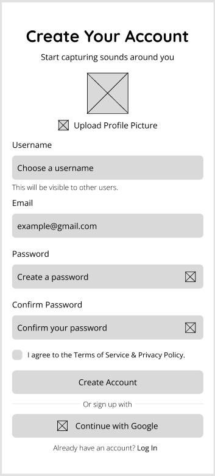
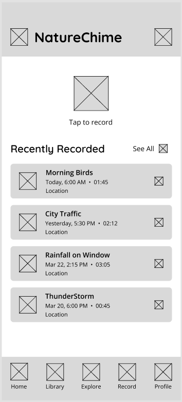
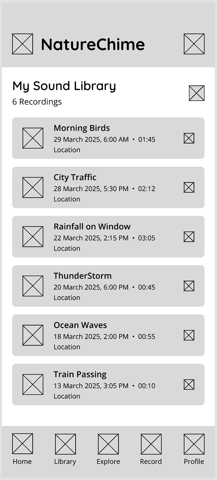
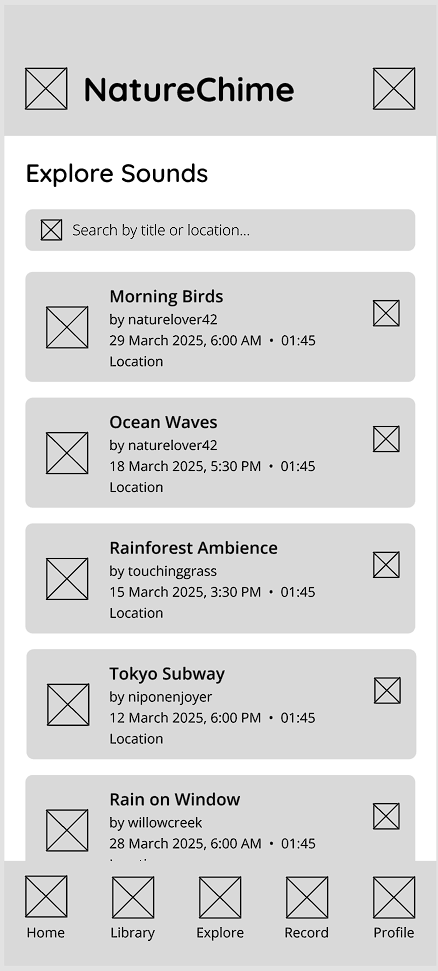
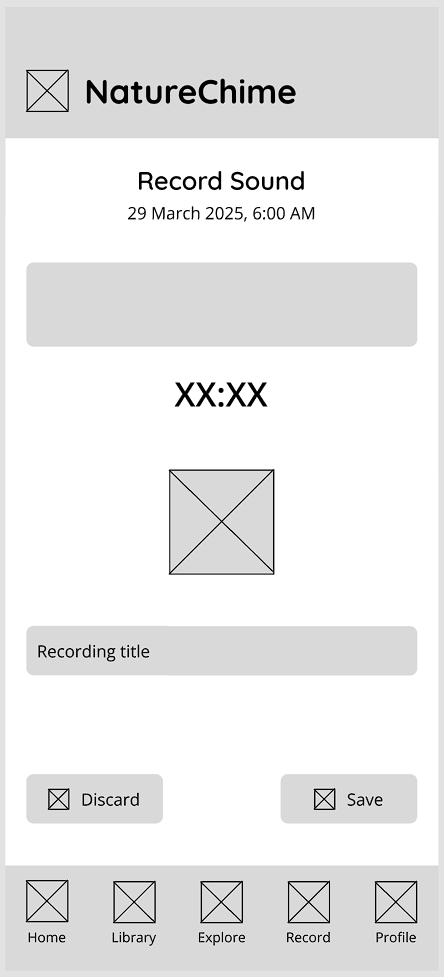
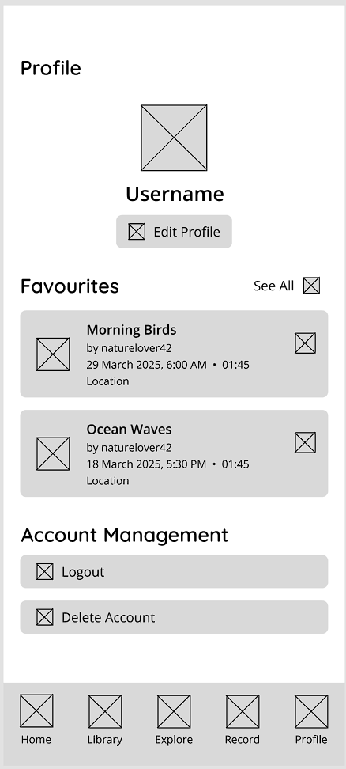
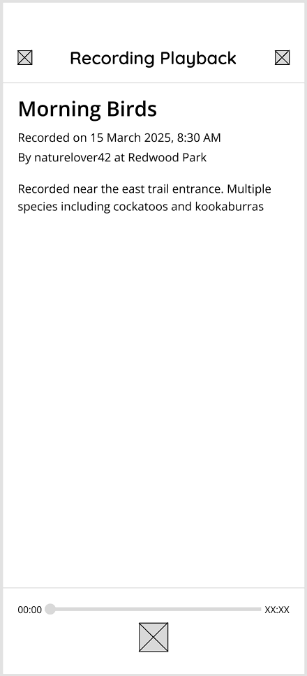

# NatureChime

## _"Capture the world, one sound at a time."_

NatureChime is a mobile application designed to help users discover, record, and catalog the diverse audio environments that surround us daily. From the gentle rustling of leaves in a forest to the rhythmic clatter of a passing train, our world is filled with distinctive sounds that often go unnoticed or undocumented. NatureChime lets users capture these audio moments, and build personal sound libraries.

Unlike traditional audio recording apps that focus on voice memos or music creation, NatureChime is specifically designed for environmental sound collection. Whether you're a nature enthusiast documenting bird calls, an urban explorer mapping city soundscapes, or someone who simply appreciates unique audio experiences, NatureChime provides the tools to create a personal archive of environmental sounds.

## Main Features of NatureChime

### Core Functionality

#### Sound Recording & Capture

- One-touch recording activation (start/stop button)
- Automatic metadata capture (time, date)
- Manual entry for title and description
- Geolocation capture (optional)

#### Sound Organisation & Management

- View a list of recordings (title, date recorded)
- Edit recording details (rename, update description)
- Delete recordings (with confirmation prompt)
- Store/retrieve recordings from Firebase Storage

#### Playback

- Basic playback controls (play/pause, seek bar)
- Recording details display during playback
- Delete/edit options for recordings

#### User Authentication & Profile

- Sign up/login with Firebase Authentication
- Personal profile displaying profile picture, username and email
- Log out functionality

#### Basic UI & Navigation

- Home screen displaying recordings
- Navigation between home, record, library, explore, and profile screens
- Loading/error handling

### Additional Features

#### Advanced Audio Features

- High-quality audio recording with adjustable settings
- Waveform visualisation during recording and playback
- Noise reduction

#### Enhanced Organisation

- Tagging system
- Search and filtering by title, location, date

#### User Experience

- Dark mode
- Favourites system for quick access to preferred sounds
- Offline recording capability with later synchronisation

#### Community Features

- Option to make recordings public or keep them private
- Likes and comments system for community engagement
- Following system to track favorite sound collectors

## User Analysis of Nature Chime

### Target User Groups

NatureChime appeals to several distinct user segments, each with different motivations for capturing environmental sounds:

#### Nature Enthusiasts & Outdoor Adventurers

This group values documenting authentic natural soundscapes during their outdoor activities. They seek to preserve memories of their experiences and create personal collections of natural sounds from different environments, seasons, and locations.

#### Urban Explorers & City Dwellers

These users are fascinated by the distinctive sounds of urban environments. They enjoy discovering and documenting the unique acoustic character of different cities, neighborhoods, and human-made structures, from subway stations to historic buildings.

#### Mindfulness Practitioners & Sound Therapy Users

These users collect calming or interesting sounds to use for meditation, relaxation, or sound therapy. They focus on sounds that evoke specific emotions or mental states, such as gentle rainfall or distant wind chimes.

### Potential User Groups

#### Content Creators & Educators

This segment includes podcasters, filmmakers, teachers, and other creators who collect environmental sounds for their projects. They value high-quality recordings and detailed metadata for potential reuse in various creative and educational contexts.

#### Acoustic Ecology Enthusiasts & Researchers

This niche but passionate user group is interested in documenting changing soundscapes for cultural preservation, environmental awareness, or scientific documentation, capturing sounds that might be disappearing due to environmental changes.

### User Personas

#### **Emma, 34 - The Nature Enthusiast**

**Background**: Wildlife biologist and amateur photographer

**Motivation**: Documenting biodiversity through sound

**Behaviours**: Regular hiking trips to national parks and nature reserves, particularly interested in bird calls and seasonal variations in forest sounds

**Usage Pattern**: Records weekly during outdoor excursions, meticulously tags and categorises findings, occasionally shares interesting discoveries

**Pain Points**: Existing apps lack proper organization systems for nature sounds

#### **Marcus, 27 - The Urban Sound Explorer**

**Background**: Architectural student and podcast listener

**Motivation**: Capturing the voice of different urban spaces

**Behaviours**: Explores different neighborhoods on weekends, fascinated by how sound reflects cultural and structural aspects of cities

**Usage Pattern**: Records spontaneously while commuting or exploring, uses location features heavily, actively shares favorite urban soundscapes with friends

**Pain Points**: Wants better ways to organize city sounds, existing apps are too focused on music or voice memos

#### **Sophia, 42 - The Mindfulness Practitioner**

**Background**: Yoga instructor and wellness blogger

**Motivation**: Collecting calming sounds for classes and personal practice

**Behaviours**: Seeks out peaceful environments, records longer ambient soundscapes

**Usage Pattern**: Selective recording of peaceful sounds, focused on playback quality, less interested in social features

**Pain Points**: Other apps have too much ambient noises, wants clean recordings for professional use

### Competitive Advantage

Users choose NatureChime over alternatives for several key reasons:

#### Compared to General Recording Apps (Voice Memos, Field Recording Apps)

- Purpose-built interface specifically for environmental sounds
- Automatic metadata and context capture
- Organization system designed for sound types rather than just dates or titles
- Community of like-minded sound enthusiasts

#### Compared to Social Audio Platforms (SoundCloud, Audio-sharing Apps)

- Focus on environmental sounds rather than music or podcasts
- Location-based discovery features
- More detailed metadata and context preservation
- More privacy options for personal collections

#### Compared to Professional Sound Equipment/Software

- Accessibility for non-technical users
- Mobile-first approach for spontaneous recording
- Built-in community and discovery features
- No expensive equipment required

NatureChime fills a unique niche between professional audio tools and casual recording apps, offering the perfect balance of functionality, community engagement, and ease of use for people who want to capture and appreciate the everyday sounds around them.

## App Design

### Key Screen Designs and User Flows

#### Welcome Screen

#### Login Screen

#### Create Account Screen

#### Authentication Flow

The welcome screen introduces users to NatureChime's core functionalities. New users can create an account with email or Google login, while returning users enter through a streamlined login process. The account creation screen collects essential information while clearly communicating privacy practices.

**Key Design Elements:**

- Brief, iconographic representation of core features
- Clear call-to-action buttons for Sign Up and Login
- Option to explore limited features before signing up

**User Flow:**

From the welcome screen, users can either:

1. Tap "Create Account" to create a new account (transitions to create account screen)
2. Tap "Log In" if they're returning users (transitions to login screen)
3. Tap "Explore Without Account" to browse public recordings without an account (transitions to explore screen)

#### Home Screen

The Home screen features recently recorded sounds, and quick-access recording control.

**Key Design Elements:**

- Floating action button for instant recording
- four recent recordings displayed as lists with title, date, and location
- Bottom navigation providing access to all main sections

**User Flow:**

The dashboard connects to all primary functions:

1. Tap the microphone button to start recording (transitions to recording screen)
2. Tap any recent recording to view detailed playback (transitions to playback screen)
3. Use bottom navigation to access other main sections

#### Library Screen

The Library screen provides a list view to browse personal recordings and a search button to look for a specific recording.

**Key Design Elements:**

- List view displays recordings with title, date, and location
- Search button to find recordings
- Number of total recordings shown at the top
- 3 dots icon to delete and edit on the right side of each recording list
- Bottom navigation providing access to all main sections

**User Flow:**

1. Tap any recording to open detailed view (transitions to playback screen)
2. Tap the search button to narrow results by title, date, or location
3. Tap 3 dots icon to delete recording or edit recording description
4. Use bottom navigation to access other main sections

#### Explore Screen

The Explore screen features a search bar and a list view for browsing recordings from other users, listening to them, and marking them as favorites.

**Key Design Elements:**

- The list view displays recordings with the title, the user who recorded them, the date, time, and location.
- A search bar to find specific recordings
- A button for putting recording to Favourites

**User Flow:**

1. Tap any recording to open detailed view (transitions to playback screen)
2. Tap the search bar to narrow results by title, user, or location
3. Tap the heart icon to favourite a recording
4. Use bottom navigation to access other main sections

#### Record Screen

The Record screen focuses on essential functionality: starting, stopping, discarding and saving recordings.

**Key Design Elements:**

- Record button (Tap to start/stop)
- Recording timer displays elapsed time
- Audio level indication shows simple visual feedback for audio input levels
- Basic metadata capture (date/time of the recording)
- Manual title input
- Save/discard button

**User Flow:**

1. Tap the mic icon to start recording or stop recording
2. Input recording title
3. Save button to save the recording
4. Discard button to discard the recording

#### Profile Screen

The Profile screen includes a profile picture, username, edit profile button, favourite recordings, and account management options.

**Key Design Elements:**

- Profile displaying a profile picture, username and edit profile button
- Last two favourite recordings with an option to view all favourite recordings
- Account management

**User Flow:**

1. Tap edit profile button to edit the profile picture and username
2. Tap on any of the favourite recording to open detailed view (transition to playback screen)
3. Tap the heart icon to unfavourite a recording
4. Tap Logout button to log out of the account
5. Tap Delete Account button to delete the account

#### Playback Screen

The Playback Screen allows users to navigate through the recording.

**Key Design Elements:**

- Play/pause button in the center of the control bar
- Seek bar that shows progress and allows users to navigate through the recording.
- Elapsed time/total duration displays current position and total length in minutes:seconds format
- Recording details

**User Flow**:

1. Play/pause controls for immediate listening
2. Interact with seek bar to jump to specific parts
3. Tap back button to go back to previous page
4. Tap 3 dots icon to edit or delete a recording if the recording is owned by the user

### Transitions

The app uses thoughtful transitions to enhance the user experience:

- Smooth transitions between related screens maintain context
- Playback controls transform naturally between states

### Accessibility Considerations

The design prioritises accessibility through high contrast text options.

## MVP Scope

### Core MVP Components

#### User Authentication & Profile

- Basic email/password authentication using Firebase
- Simple user profile displaying username and email
- Basic profile customization (username, profile picture)
- Account management (password reset, account deletion)

#### Sound Recording Functionality

- Audio recording with basic controls (start/stop)
- Duration display during recording
- Automatic metadata capture (location)
- Manual title and description entry

#### Sound Library Management

- List view of all user recordings
- Simple search functionality by title
- Storage and retrieval of audio files using Firebase Storage

#### Sound Playback

- Standard playback controls (play/pause)
- Progress bar with seeking capability
- Recording information display
- Edit/delete options for user's own recordings

#### Basic UI Implementation

- Clean, intuitive navigation between main screens
- Responsive design for different device sizes
- Consistent styling following design system
- Essential loading and error states

### Stretch Goals

#### Enhanced UI Implementation

- Dark mode toggle

#### Sound Library Management

- Basic filtering by date recorded
- Basic categorization system (predefined categories)

#### Enhanced Recording Features

- Simple waveform visualization during recording
- Advanced audio settings (quality, format)
- Audio trimming capability
- Background noise reduction

#### Community Features

- Public/private toggle for recordings
- Following other users

#### Community sound feed

- Comments and likes on recordings
- Featured recordings and collections

#### Advanced Organization

- Custom tags and categories
- Advanced search with multiple parameters

#### Additional Enhancements

- Export and sharing capabilities
- Offline mode with synchronization

### Development Prioritisation

The MVP development will follow this priority sequence:

1. Core audio recording and playback functionality
2. User authentication and data storage
3. Basic CRUD operations for sound management
4. Essential UI components and navigation
5. Profile and settings functionality

This approach ensures that the foundational elements of NatureChime are solid before adding more complex features. By focusing on these core components, the MVP will demonstrate all required CRUD operations while providing genuine utility to users.
